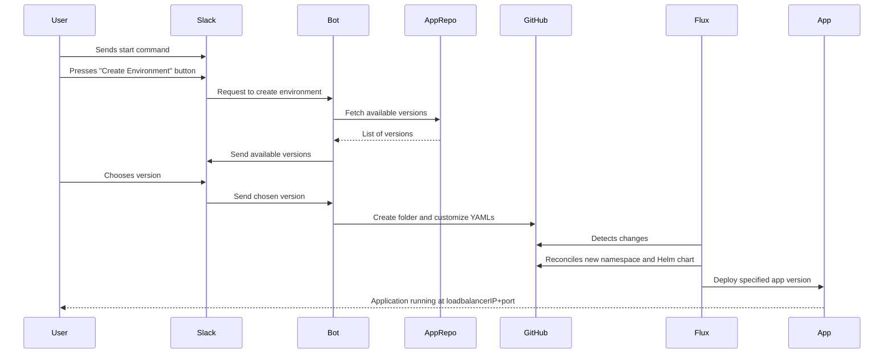

# High level design of Slack bot for preview environment creation

# High-Level Design (HLD) for Slack-Based Environment Creation System

## Overview

This document provides a high-level design for a system that allows users to create environments through Slack. The system leverages GitOps with Flux to manage environment deployments.

## Components

1. **User**: Initiates the process through Slack.
2. **Slack**: The communication platform where users interact with the system.
3. **Bot**: Acts as an intermediary between Slack and the Git repository.
4. **App Repository**: Stores the available versions of the application.
5. **GitHub Repository**: Used for GitOps with Flux to manage the environments.
6. **Flux**: Monitors the GitHub repository and reconciles the state to deploy the specified application version.

## Workflow

1. **User Sends Start Command in Slack**
    - The user initiates the process by sending the start command in Slack.

2. **User Presses Create Environment Button in Slack**
    - Slack presents a button to the user to create a new environment.
    - The user clicks the "Create Environment" button.

3. **Slack Sends Request to Bot**
    - Slack sends a request to the Bot to create a new environment.

4. **Bot Fetches Available Versions from App Repository**
    - The Bot retrieves the list of available application versions from the app repository.

5. **Bot Sends Available Versions to Slack**
    - The Bot sends the list of available versions back to Slack.
    - The user is presented with a list of versions to choose from.

6. **User Chooses Version in Slack**
    - The user selects a specific version from the list.

7. **Slack Sends Chosen Version to Bot**
    - Slack sends the selected version information to the Bot.

8. **Bot Creates Folder in GitHub Repository**
    - The Bot creates a new folder in the GitHub repository following the naming convention `feature(or QA)+version`.
    - The Bot customizes the parameters of template YAMLs to pull the specified application version's Helm chart and set a specific port (e.g., 10001).

9. **Flux Reconciles New Namespace and Helm Chart**
    - Flux detects the new folder in the GitHub repository.
    - Flux reconciles the state by deploying the specified application version in the namespace `feature(or QA)+version`.

10. **Application Running and Accessible**
    - The application is deployed and running.
    - The application is accessible through `loadbalancerIP+port`.

## Sequence Diagram

## Conclusion

This system provides a seamless way for users to create and manage environments through Slack, leveraging GitOps with Flux for automated and secure deployments.

User sends start command in Slack. Press create environment button in Slack. Slack sends to Bot request to create environment. Bot then fetches available versions from app repository. After Bot sends available versions to Slack, where user chooses version. Slack the sends version to bot. Bot then creates in github repository(for gitops flux approach) folder with the name feature(or QA)+version and kustomizes parameters of template yamls to pull specific application version helm chart and to set specific port for this app version, for example 10001. After that FLUX can see, that new namespace + helm chart need to be reconciled, and deploys specified app version in namespace feature(or QA)+version. After that application is running and accesible through loadbalancerIP+port.

## Interconnection Between Slack Bot and Plugins 🌐🤖✨

Here's how the magic happens behind the scenes when you interact with our Cloud Climbers Slack Bot: When a user clicks a button or type a command, Slack sends the event to the bot via the Events API and Socket Mode using a WebSocket connection. The bot, implemented using Go, processes the event and determines the appropriate plugin based on the action ID specified in the event payload. The bot then sends an HTTP POST request to the plugin's endpoint, which is specified in a YAML configuration file. The plugin, which can be developed in any language and hosted as a container, receives the request, processes the command using provided variables, and responds with a JSON payload containing text and interactive elements like buttons or input fields. The bot processes this response, formats it into a Slack message, and sends it back to the user in the Slack channel, providing a seamless and interactive experience.

##
## **📜 Love logging** 
 