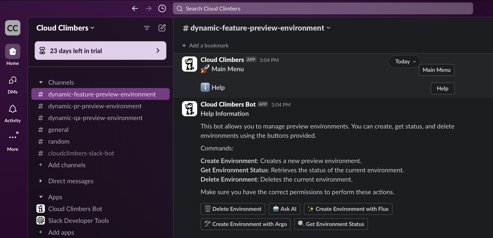
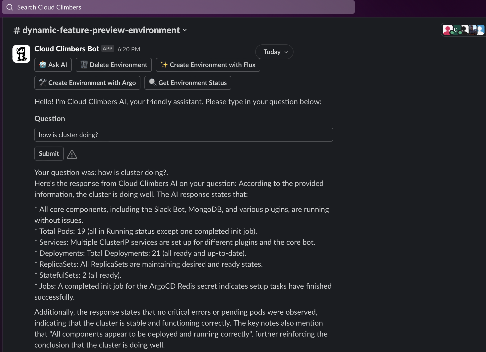
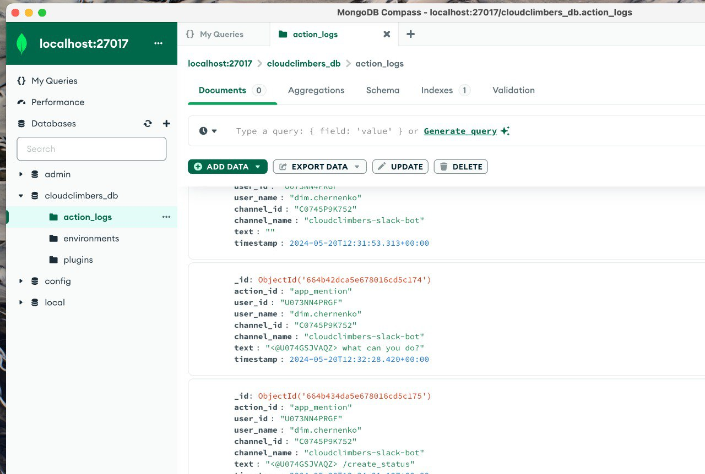

# Cloud Climbers Slack Bot

## Key Features

🚀 **Preview Environments**: 
- The Cloud Climbers Slack Bot helps software teams increase their development velocity by reducing the time it takes to test and release new features. It allows for the creation, status check, and deletion of preview environments directly from Slack. And much more...

🧩 **Up-to-date approach**:
- Implements "best-practices" pull GitOps approach using Flux. This allows to use secure and standartized operations.

🧩 **Plugin Development**:
- The Cloud Climbers Slack Bot supports community contributions for plugin development in any programming language. Whether you prefer Python, Go, JavaScript, or any other language, you can create plugins that interact with the bot through simple HTTP endpoints. Because plugins are Docker containers. 🤓

🛠 **Extensible and Customizable**: 
- The bot's architecture is designed to be extensible and customizable. Community members can develop and share plugins to extend the functionality of the bot, catering to specific needs and workflows. Add AI, cleanup, FLUX, Jenkins in 5 minutes. It is that easy.

🕹️ **Buttons in Slack** 
- Not commands. Because buttons are more robust for user interfaces.

🔐 **Secure** 
- The only external connectivity bot has is websocket connection to Slack servers.

🏗️ **AI** 
- Bot has AI plugin augmented with Kubernetes environment preview status and other data to help developer understand possible issues, get useful stats etc.
Image to illustrate AI

📜 **Love logging** 
 

## Interconnection Between Slack Bot and Plugins 🌐🤖✨

Here's how the magic happens behind the scenes when you interact with our Cloud Climbers Slack Bot: When a user clicks a button or type a command, Slack sends the event to the bot via the Events API and Socket Mode using a WebSocket connection. The bot, implemented using Go, processes the event and determines the appropriate plugin based on the action ID specified in the event payload. The bot then sends an HTTP POST request to the plugin's endpoint, which is specified in a YAML configuration file. The plugin, which can be developed in any language and hosted as a container, receives the request, processes the command using provided variables, and responds with a JSON payload containing text and interactive elements like buttons or input fields. The bot processes this response, formats it into a Slack message, and sends it back to the user in the Slack channel, providing a seamless and interactive experience.

### Key Technologies and Protocols

- **Slack Events API & Socket Mode**: To receive real-time events from Slack.
- **Go**: For implementing the bot.
- **HTTP/REST**: For communication between the bot and plugins.
- **YAML**: For configuring plugins and their endpoints.
- **JSON**: For the payloads sent between the bot and plugins.

This setup allows for a highly flexible and extendable bot architecture, encouraging community contributions! 🌍👨‍💻👩‍💻

### Example Plugin Configuration

---------

### 🍿 Getting Started
- Clone the Repository: Clone the Cloud Climbers Slack Bot repository to your local machine.
- Configure the Bot: Update the YAML configuration file with your Slack tokens, MongoDB URI, and plugin URLs.
- Run the Bot: Use Makefile to build and run the bot and its plugins.
- Develop Plugins: Create your plugins and register them in the YAML configuration file.

---

### 🌐 We are the "Cloud Climbers" - Hackathon Team (Credits)

---

#### 🚀 **Members**

- [**Dmytro Chernenko**](https://github.com/diamonce) (Team Lead)
- **Vladyslav Plaksa**
- **Svitlana Dmytrenko**
- [**Denis Klopotovskis**](https://github.com/denisklp)
- [**Andrij Zelenyy**](https://github.com/AZelyony)

#### 🤖 **Product Focus**
- **Artificial Intelligence (AI)**

#### 🕒 **Work Style**
- **Asynchronous** - One Zoom call per week %)

#### 🌐 **Design Data**
- **[Architecture decisions recod](/ADR)**
- **[High-Level Design](/HLD)**
- **[Plugins explained](/plugins-expl)**

#### 📊 **Planning Style**
- **Agile** - We plan in Sprints but use 1 Story Point = 1 Hour
- **Team Capacity** 48 H / Sprint. Each team member can do 6 hours in a week.

#### 🎯 **Goal**
- **Minimum Viable Product** in the form of GitHub release.

#### 🛠 **Tools**
- **Project Management:** [JIRA](https://mindocloud.atlassian.net/)
- **Diagrams:** We use Miro boards [Miro](https://miro.com/)
- **Chat:** Telegram Group

#### Quick Start
Start your day with setting up the environment

# brew install pre-commit
# pre-commit install
# pre-commit run --all-files
